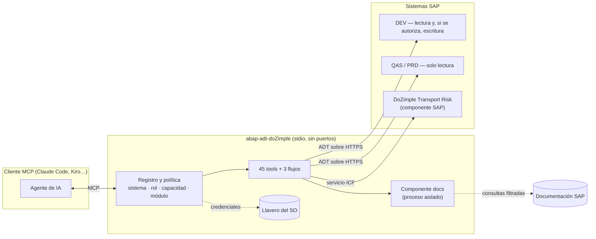

<div align="center">

# abap-adt-doZimple

[English](README.md) · **Español**

[](../../actions/workflows/ci.yml)    

**IA que trabaja en tu SAP con las reglas de un consultor senior.**

Servidor [MCP](https://modelcontextprotocol.io) de **[DoZimple](https://dozimple.cl)** que da a los agentes de IA —
Claude Code, Kiro o cualquier cliente MCP — acceso seguro y verificable a sistemas SAP ABAP:
revisar código y órdenes de transporte, ejecutar ATC y ABAP Unit, diagnosticar incidentes, consultar la
documentación oficial y, donde se autorice, guardar cambios en la orden correcta.

**45 tools · 9 grupos funcionales · 3 flujos guiados · ECC 6.0 (NW 7.50) y S/4HANA**

[Funcionalidades](#funcionalidades-por-grupo) · [Referencia completa de tools](docs/TOOLS.md) ·
[Seguridad](SECURITY.md) · [DoZimple Transport Risk](#dozimple-transport-risk) · [Créditos](#créditos) · [Contacto](https://dozimple.cl)

</div>

---

## Qué le puedes pedir

> «¿Qué cambia de verdad la orden DEVK900123 y qué objetos suelen viajar con ella que no van dentro?»
>
> «Pasa el ATC a ZDEMO_REPORTE, explícame los hallazgos P1 con su nota SAP y propón la corrección que ofrece SAP.»
>
> «¿Se puede usar `COND` en este sistema 7.50? Si no, reescribe el método con sintaxis compatible y valídalo contra SAP.»
>
> «El job de facturación de anoche falló: dumps, log del job y log de aplicación, y dime la causa probable.»
>
> «¿Este pase de cuatro órdenes está listo para productivo? Dímelo en lenguaje de negocio para el PMO.»

El agente elige las tools, las encadena y responde con evidencia. Cada respuesta indica de qué sistema viene, y
**un fallo nunca se presenta como resultado vacío o como éxito**.

## Por qué es distinto

| | Enfoque habitual | **abap-adt-doZimple** |
|---|---|---|
| Sistemas | Uno por instancia, sin roles | Todos los de la organización, con política por rol: DEV / QAS / PRD |
| Escritura | Guarda donde SAP decida, o no permite escribir | Solo en desarrollo, con orden explícita, vista previa y confirmación humana; se detiene ante un bloqueo CTS ajeno |
| Verificación | abaplint o nada | Sintaxis real de SAP, también sobre código aún no guardado |
| Parámetros | Un parámetro mal escrito se ignora en silencio y la llamada sigue | **Los parámetros desconocidos se rechazan con la lista de los admitidos**: un `transprot` mal escrito nunca se ejecuta sin la orden que querías |
| Resultados ante un fallo | Listas vacías o «OK» engañosos | Error tipado que dice qué no se pudo comprobar y por qué |
| Releases | Endpoints fijos | Capacidades leídas del discovery ADT de cada sistema |
| IDE | Suele exigir el IDE abierto | Servidor independiente, sin IDE |
| Terceros | Dependencias mezcladas con las credenciales | Componentes aislados en su propio proceso y filtrados |

## Visión general

<!-- groups:start -->
| Grupo | Para qué | Tools |
|---|---|---|
| [Revisión de código y pases](#g-revision) | Saber qué cambia de verdad una orden y qué puede romper, antes de liberarla. | 5 |
| [Calidad, ATC y remediación](#g-calidad) | Encontrar, entender y corregir hallazgos con la sintaxis y las correcciones reales de SAP. | 5 |
| [Exploración del repositorio](#g-exploracion) | Leer y entender cualquier objeto ABAP y sus relaciones, en ECC y en S/4HANA. | 9 |
| [Consulta de datos](#g-datos) | Preguntar a las tablas con ABAP SQL, de solo lectura y sin tocar material de credenciales. | 2 |
| [Diagnóstico de incidentes](#g-diagnostico) | Reunir en una conversación lo que antes exigía ST22, SM37, SLG1 y /IWFND/ERROR_LOG. | 4 |
| [Documentación SAP](#g-documentacion) | Responder con la documentación oficial y comprobar qué sintaxis existe en cada release. | 7 |
| [Escritura controlada](#g-escritura) | Guardar cambios solo en desarrollo, en la orden correcta y con la sintaxis verificada antes. | 4 |
| [DoZimple Transport Risk](#g-transport-risk) | Decidir si un pase entero puede ir a calidad o productivo, con el porqué en lenguaje de negocio. | 7 |
| [Operación y crecimiento](#g-operacion) | Ver qué funciona en cada sistema y decidir con datos cuál es la siguiente tool. | 4 |
<!-- groups:end -->

## Arquitectura



## Funcionalidades por grupo

Resumen por grupo; el detalle de cada tool —parámetros, tipos, valores por defecto, requisitos y créditos— está en
la **[referencia completa](docs/TOOLS.md)**.

<!-- tools:start -->
<a id="g-revision"></a>
### Revisión de código y pases

*Saber qué cambia de verdad una orden y qué puede romper, antes de liberarla.*

| Tool | Qué hace | Acceso |
|---|---|---|
| [`transport_diff`](docs/TOOLS.md#revision) | **Qué cambió una orden (diff de código).** Revisión de código de una orden: por cada objeto con fuente (programas, includes, clases, interfaces, FM, CDS) compara la versión grabada con esa orden (o sus tareas) contra la versión anterior, y muestra el diff unificado. | lectura |
| [`transport_contents`](docs/TOOLS.md#revision) | **Contenido de una orden.** Cabecera, tareas (con dueño y estado) y objetos de una orden de transporte, leídos de E070/E07T/E071. | lectura |
| [`co_change`](docs/TOOLS.md#revision) | **¿Con qué suele viajar este objeto?** Mira las órdenes que tocaron un objeto y cuenta qué otros objetos viajaron con él, de más a menos frecuente. | lectura |
| [`inactive_objects`](docs/TOOLS.md#revision) | **Objetos sin activar.** Objetos con versión inactiva (guardados sin activar) del usuario de la conexión, con su orden. | lectura |
| [`edit_preflight`](docs/TOOLS.md#revision) | **Antes de editar: ¿a qué orden irá?** Dice, ANTES de modificar un objeto, en qué orden acabará el cambio y por qué: bloqueo del CTS (TLOCK) de otra orden, objeto local ($TMP), reparación (sistema original distinto), o si está libre y qué órdenes tienes abiertas. | lectura |

<a id="g-calidad"></a>
### Calidad, ATC y remediación

*Encontrar, entender y corregir hallazgos con la sintaxis y las correcciones reales de SAP.*

| Tool | Qué hace | Acceso |
|---|---|---|
| [`run_atc`](docs/TOOLS.md#calidad) | **Ejecutar ATC.** Ejecuta el ATC sobre un objeto o una orden de transporte y lista los hallazgos numerados (prioridad, línea, check, mensaje), con los totales P1/P2/P3 que da SAP. | lectura |
| [`atc_quickfix`](docs/TOOLS.md#calidad) | **Correcciones propuestas por SAP.** Correcciones que SAP ofrece (las mismas de Ctrl+1 en Eclipse) para un hallazgo ATC o una línea: crear símbolo de texto, extraer constante, etc. | lectura |
| [`api_release_state`](docs/TOOLS.md#calidad) | **¿Está liberada esta API? ¿Cuál es su sucesor?** Estado de liberación de un objeto SAP (clase, FM/BAPI, tabla, CDS…) por contrato C0–C4 y su sucesor liberado, leído del propio sistema. | lectura |
| [`syntax_check`](docs/TOOLS.md#calidad) | **Chequeo de sintaxis SAP.** Chequeo de sintaxis real de SAP (no abaplint). | lectura |
| [`run_unit_tests`](docs/TOOLS.md#calidad) | **Ejecutar ABAP Unit.** Ejecuta los tests ABAP Unit de una clase o programa y devuelve el resultado por método, con el detalle de cada fallo. | ejecuta (DEV) |

<a id="g-exploracion"></a>
### Exploración del repositorio

*Leer y entender cualquier objeto ABAP y sus relaciones, en ECC y en S/4HANA.*

| Tool | Qué hace | Acceso |
|---|---|---|
| [`search_objects`](docs/TOOLS.md#exploracion) | **Buscar objetos ABAP.** Busca objetos del repositorio por nombre (admite * como comodín). | lectura |
| [`get_source`](docs/TOOLS.md#exploracion) | **Leer fuente ABAP.** Lee la fuente de cualquier objeto: programa, include, clase (y sus includes), interfaz, módulo de función (sin necesidad de saber el grupo), CDS, tabla/estructura, etc. | lectura |
| [`where_used`](docs/TOOLS.md#exploracion) | **Dónde se usa.** Lista de uso (where-used) de un objeto: quién lo referencia, con paquete y responsable. | lectura |
| [`object_versions`](docs/TOOLS.md#exploracion) | **Versiones de un objeto.** Historial de versiones de un objeto (fecha, autor, orden). | lectura |
| [`package_contents`](docs/TOOLS.md#exploracion) | **Contenido de un paquete.** Objetos de un paquete de desarrollo agrupados por tipo, con sus subpaquetes (TADIR/TDEVC, cualquier release). | lectura |
| [`ddic_type_info`](docs/TOOLS.md#exploracion) | **Elemento de datos, dominio o tipo tabla.** Definición de un tipo DDIC: elemento de datos (dominio, tipo, longitud, textos), dominio (tipo, longitud, valores fijos, tabla de valores) o tipo tabla (tipo de línea, clave). | lectura |
| [`transaction_info`](docs/TOOLS.md#exploracion) | **Qué ejecuta una transacción.** Programa, dynpro y parámetros de una transacción (TSTC/TSTCP), con su texto. | lectura |
| [`function_modules`](docs/TOOLS.md#exploracion) | **Módulos de función de un grupo.** Lista los módulos de función de un grupo de funciones, con su texto y si son RFC o de actualización. | lectura |
| [`text_elements`](docs/TOOLS.md#exploracion) | **Símbolos de texto y textos de selección.** Lee los símbolos de texto (TEXT-001…), textos de selección o encabezados de un programa, clase o grupo de funciones. | lectura |

<a id="g-datos"></a>
### Consulta de datos

*Preguntar a las tablas con ABAP SQL, de solo lectura y sin tocar material de credenciales.*

| Tool | Qué hace | Acceso |
|---|---|---|
| [`sql_query`](docs/TOOLS.md#datos) | **Consulta ABAP SQL.** Ejecuta un SELECT de ABAP SQL (con WHERE, JOIN, ORDER BY, subconsultas) vía la vista previa de datos de ADT. | lectura |
| [`table_contents`](docs/TOOLS.md#datos) | **Contenido de una tabla.** Filas de una tabla, vista o CDS, con columnas y filtro opcionales. | lectura |

<a id="g-diagnostico"></a>
### Diagnóstico de incidentes

*Reunir en una conversación lo que antes exigía ST22, SM37, SLG1 y /IWFND/ERROR_LOG.*

| Tool | Qué hace | Acceso |
|---|---|---|
| [`dumps`](docs/TOOLS.md#diagnostico) | **Dumps (ST22).** Lista los dumps de ejecución (ST22): fecha, error, programa, usuario y texto corto. | lectura |
| [`jobs`](docs/TOOLS.md#diagnostico) | **Jobs de fondo (SM37).** Jobs de fondo por nombre (admite *), usuario, estado y fecha, con sus pasos (programa y variante). | lectura |
| [`application_log`](docs/TOOLS.md#diagnostico) | **Log de aplicación (SLG1), cabeceras.** Cabeceras del log de aplicación (BALHDR) por objeto/subobjeto, nº externo, usuario y fecha, con el recuento de errores y avisos. | lectura |
| [`gateway_errors`](docs/TOOLS.md#diagnostico) | **Errores de SAP Gateway (/IWFND/ERROR_LOG).** Lista los errores del log de SAP Gateway (servicios OData): servicio, error, usuario, fecha. | lectura |

<a id="g-documentacion"></a>
### Documentación SAP

*Responder con la documentación oficial y comprobar qué sintaxis existe en cada release.*

| Tool | Qué hace | Acceso |
|---|---|---|
| [`abap_feature_matrix`](docs/TOOLS.md#documentacion) | **¿Desde qué release existe esta sintaxis?** Disponibilidad de cada característica del lenguaje ABAP por release (7.40 … 7.58, 2025). | local |
| [`docs_search`](docs/TOOLS.md#documentacion) | **Buscar en la documentación ABAP.** Busca en la documentación oficial ABAP (keyword docs estándar y cloud), Clean ABAP, guía DSAG, ABAP cheat sheets y ejemplos RAP, en local. | local |
| [`docs_fetch`](docs/TOOLS.md#documentacion) | **Leer un documento de la documentación.** Devuelve el contenido completo de un documento por su id (el que da docs_search). | local |
| [`clean_core_objects`](docs/TOOLS.md#documentacion) | **Catálogo de objetos liberados (Clean Core).** Busca en el catálogo público de SAP (abap-atc-cr-cv-s4hc, local) objetos liberados/obsoletos por nombre o tema, con nivel Clean Core (A liberado … D todo) y sucesores. | local |
| [`clean_core_object`](docs/TOOLS.md#documentacion) | **Estado Clean Core de un objeto SAP.** Estado de liberación, nivel Clean Core y sucesor de un objeto SAP según el catálogo público (local). | local |
| [`abap_lint`](docs/TOOLS.md#documentacion) | **abaplint sobre un fragmento.** Pasa abaplint (local, el código no sale del equipo) sobre un fragmento o fuente ABAP. | local |
| [`docs_community_search`](docs/TOOLS.md#documentacion) | **Buscar en SAP Community.** Busca en SAP Community (blogs y preguntas) por mensaje de error, clase o concepto. | local |

<a id="g-escritura"></a>
### Escritura controlada

*Guardar cambios solo en desarrollo, en la orden correcta y con la sintaxis verificada antes.*

| Tool | Qué hace | Acceso |
|---|---|---|
| [`write_source`](docs/TOOLS.md#escritura) | **Guardar fuente en SAP.** Sustituye la fuente COMPLETA de un objeto existente (o de un include de clase), en la orden indicada. | escribe (DEV autorizado) |
| [`activate`](docs/TOOLS.md#escritura) | **Activar objeto.** Activa un objeto y devuelve los mensajes de SAP tal cual (errores con línea, avisos, objetos que quedan inactivos). | escribe (DEV autorizado) |
| [`write_text_elements`](docs/TOOLS.md#escritura) | **Crear o cambiar símbolos de texto.** Añade o modifica símbolos de texto (o textos de selección) de un programa/clase/grupo, fusionando con los existentes: no borra los que no se mencionan. | escribe (DEV autorizado) |
| [`create_transport`](docs/TOOLS.md#escritura) | **Crear orden de transporte.** Crea una orden workbench para el paquete de un objeto, ANTES de la primera edición, para que el cambio caiga en la orden del ticket y no en una tarea reutilizada. | escribe (DEV autorizado) |

<a id="g-transport-risk"></a>
### DoZimple Transport Risk

*Decidir si un pase entero puede ir a calidad o productivo, con el porqué en lenguaje de negocio.*

| Tool | Qué hace | Acceso |
|---|---|---|
| [`analyze_transport_risk`](docs/TOOLS.md#transport-risk) | **Riesgo de transporte.** Dice si una orden (o un pase de varias, separadas por coma) es segura para pasar a calidad o productivo: tareas sin liberar, estado de importación, dependencias que no viajan, acceso posicional, bloqueos del CTS, cola de importación. | lectura |
| [`import_health`](docs/TOOLS.md#transport-risk) | **Salud de importaciones.** Salud de las importaciones de un destino (calidad o productivo): responde «¿cómo van los pases a productivo?». | lectura |
| [`failure_ranking`](docs/TOOLS.md#transport-risk) | **Objetos que más fallan al importar.** Ranking de objetos por historial de fallos de importación en un destino. | lectura |
| [`change_audit`](docs/TOOLS.md#transport-risk) | **Evidencia de auditoría de cambios.** Evidencia para una auditoría de gestión de cambios en un destino: qué entró, con qué ticket, de qué iniciativa y origen. | lectura |
| [`object_transport_history`](docs/TOOLS.md#transport-risk) | **Historial de transportes de un objeto.** Qué órdenes han tocado un objeto, cuándo, y cuáles llegaron ya al destino. | lectura |
| [`remote_source`](docs/TOOLS.md#transport-risk) | **Fuente en el destino.** La fuente de un objeto TAL COMO ESTÁ en calidad o productivo, leída por el canal de TMS (como «Traer versiones remotas»). | lectura |
| [`transport_source_check`](docs/TOOLS.md#transport-risk) | **Código de una orden contra el destino.** Compara el código de los objetos de una orden con el del destino: objetos que no existen allí (R3.4) y deriva de versión — firmas, campos o parámetros distintos que no viajan en la orden (R3.5). | lectura |

<a id="g-operacion"></a>
### Operación y crecimiento

*Ver qué funciona en cada sistema y decidir con datos cuál es la siguiente tool.*

| Tool | Qué hace | Acceso |
|---|---|---|
| [`sap_systems`](docs/TOOLS.md#operacion) | **Sistemas SAP y tools disponibles.** Lista los sistemas configurados (rol, escritura, módulos). | local |
| [`report_gap`](docs/TOOLS.md#operacion) | **Anotar una tool que falta.** Anota una necesidad que ninguna tool cubre (p. ej. «crear una tabla en 7.50», «liberar una tarea», «leer un SmartForm»), con el rodeo que se usó. | local |
| [`close_gap`](docs/TOOLS.md#operacion) | **Cerrar un hueco anotado.** Marca como resuelto un hueco anotado con report_gap (porque ya hay una tool, o porque se comprobó que la anotación era errónea), con una nota del porqué. | local |
| [`usage_stats`](docs/TOOLS.md#operacion) | **Uso de las tools y huecos.** Resumen del registro local: llamadas por tool, tasa de fallo y tipo de fallo, sistemas, y los huecos anotados con report_gap agrupados. | local |

<!-- tools:end -->

## Flujos guiados

<!-- prompts:start -->
Aparecen como comandos en el cliente MCP (en Claude Code: `/mcp__abap-adt-doZimple__<nombre>`) y encadenan las tools
con las reglas de trabajo de un consultor senior.

| Flujo | Qué hace | Encadena |
|---|---|---|
| `revisar_pase` — Revisar una orden antes del pase | Revisión completa de una orden: código, compañeros ausentes, bloqueos y, con el módulo de riesgo, su análisis. | transport_contents → transport_diff → inactive_objects → co_change + edit_preflight → analyze_transport_risk (si hay módulo) → informe en tres capas: negocio, consultor, Basis |
| `remediar_atc` — Remediar hallazgos ATC de un objeto | ATC → documentación y nota SAP → sucesor liberado → corrección → sintaxis → guardado con orden. | edit_preflight → run_atc (BEFORE) → explain + api_release_state + where_used/object_versions → clasificación CAMBIAR/INVESTIGAR/NO_CAMBIAR → atc_quickfix → syntax_check → write_source con la orden (con OK humano) → run_atc (AFTER) y reducción de P1 |
| `diagnosticar_ticket` — Diagnosticar un incidente | Dumps, jobs, log de aplicación y errores de Gateway alrededor de un incidente. | dumps → jobs → application_log → gateway_errors → transaction_info / get_source / object_versions / transport_contents → causa probable con evidencia y lo que no se pudo comprobar |
<!-- prompts:end -->

## DoZimple Transport Risk

El módulo más valioso para la operación: **dice, antes de liberar, si una orden o un pase entero puede ir a calidad
o productivo, y por qué no**, en tres capas — veredicto de negocio para el PMO, qué revisar para el consultor y
acciones de pase para Basis.

- **Pases completos, no órdenes sueltas:** lo que viaja en una orden cubre a las demás; calcula la secuencia de
  importación, detecta dependencias mutuas y colisiones entre órdenes.
- **Lo que se rompe en silencio:** accesos posicionales a estructuras que cambian, dependencias de código y de
  diccionario que no viajan y no existen en el destino, deriva de versión.
- **El estado real del landscape:** cola de importación del destino, bloqueos del CTS, transportes de copias que
  arrastran cambios ajenos, salud de las importaciones y objetos que más fallan.
- **Evidencia para auditoría** de gestión de cambios.

Funciona sobre cualquier pila ABAP con CTS (ECC y S/4HANA) y es de solo lectura en todos los sistemas. Requiere un
**componente SAP propietario de DoZimple** (servicio ICF en desarrollo y RFC de solo lectura en los destinos), que no
se distribuye en este repositorio.

**¿Quieres implantarlo en tu landscape? → [dozimple.cl](https://dozimple.cl)**

## Seguridad

Diseñado para poder presentarse ante Seguridad y Basis sin excepciones. Detalle y modelo de amenazas:
**[SECURITY.md](SECURITY.md)**.

- **Sin superficie de red:** solo stdio; no abre puertos.
- **Credenciales en el llavero del sistema operativo,** nunca en archivos, logs ni respuestas.
- **Política por rol:** calidad y productivo nunca se escriben; en desarrollo, solo con autorización explícita.
- **Parámetros estrictos:** un parámetro desconocido o mal escrito es un error con la lista de los admitidos, nunca se ignora en silencio.
- **Ninguna escritura sin confirmación humana:** vista previa con la sintaxis de SAP y el diff real, y confirmación
  por elicitación o con un token de un solo uso atado a esos argumentos exactos.
- **Registro de auditoría encadenado por hash** de toda escritura y ejecución, verificable con `npm run audit:verify`.
- **Material de credenciales y datos de personal de SAP bloqueados** en las consultas SQL, también a través de vistas
  y CDS, aunque el usuario tenga autorización.
- **Datos personales enmascarados y tope de filas** en sistemas con datos productivos.
- **Nada de datos del cliente hacia internet:** la búsqueda online de documentación está apagada por defecto y,
  si se habilita, se filtra toda consulta con objetos, órdenes, sistemas, usuarios o nombres de cliente.
- **Terceros aislados** en su propio proceso y con entorno mínimo.
- **Cadena de suministro controlada:** 4 dependencias de producción con versión exacta, sin scripts de instalación,
  firmas verificadas, SBOM CycloneDX, auditoría y escaneo de secretos en cada commit y en CI.

Modelo de amenazas con STRIDE y OWASP Top 10 para aplicaciones LLM: **[docs/THREAT_MODEL.md](docs/THREAT_MODEL.md)**.

## Compatibilidad

| | |
|---|---|
| SAP | ECC 6.0 / NetWeaver 7.50 en adelante y S/4HANA on-premise o private cloud, vía ADT (`/sap/bc/adt`). Probado en vivo en S/4HANA 2023 (SAP_BASIS 7.58) y ECC 6.0 EHP8 (SAP_BASIS 7.50). Las funciones que dependen del release (p. ej. estado de liberación de APIs) se detectan por sistema |
| Clientes MCP | Claude Code, Kiro y cualquier cliente compatible con MCP por stdio |
| Plataforma | Node.js 22+. Credenciales en el llavero de macOS, en el Secret Service de Linux o en variables de entorno |

## Instalación

### Desde npm (recomendado)

Con la versión exacta y sin scripts de instalación, igual que las dependencias del propio proyecto:

```sh
npm install -g --ignore-scripts @dozimple/abap-adt@1.0.1
PKG="$(npm root -g)/@dozimple/abap-adt"
mkdir -p ~/.config/abap-adt-dozimple && chmod 700 ~/.config/abap-adt-dozimple
cp "$PKG/config/systems.example.json" ~/.config/abap-adt-dozimple/systems.json   # sistemas, roles y permisos
chmod 600 ~/.config/abap-adt-dozimple/systems.json
sh "$PKG/scripts/set-password.sh" MI_DEV                                        # pide la clave; va al llavero
node "$PKG/dist/scripts/smoke.js" MI_DEV                                        # validación de solo lectura
```

Registro en el cliente MCP:

```json
{ "mcpServers": { "abap-adt-doZimple": { "command": "abap-adt-dozimple" } } }
```

Cada versión se publica desde el CI con [procedencia de npm](https://docs.npmjs.com/generating-provenance-statements):
`npm view @dozimple/abap-adt@1.0.1 dist.attestations` muestra la atestación, y la release de GitHub incluye el
paquete, su bundle de Sigstore (`.sigstore.json`), el mismo bundle como procedencia in-toto (`.intoto.jsonl`)
y el SBOM. Para comprobarlo: `gh attestation verify dozimple-abap-adt-1.0.1.tgz --repo <owner>/abap-adt-dozimple`.

### Desde el código fuente

```sh
npm ci && npm run build
mkdir -p ~/.config/abap-adt-dozimple
cp config/systems.example.json ~/.config/abap-adt-dozimple/systems.json   # sistemas, roles y permisos
scripts/set-password.sh MI_DEV                                           # pide la clave; va al llavero (--strict: confirma cada lectura)
npm run smoke -- MI_DEV                                                  # validación de solo lectura
```

Registro en el cliente MCP:

```json
{ "mcpServers": { "abap-adt-doZimple": { "command": "node", "args": ["/ruta/a/abap-adt-doZimple/dist/index.js"] } } }
```

Grupo **Documentación SAP** (opcional): instala [mcp-sap-docs](https://github.com/marianfoo/mcp-sap-docs)
(Apache-2.0, variante `abap`) en una carpeta aparte y declara su arranque en `sidecars.docs` de `systems.json` (ver
`config/systems.example.json`). Corre como proceso aislado; la búsqueda online queda apagada salvo `allowOnline`.

Ver [CONTRIBUTING.md](CONTRIBUTING.md). Para contribuir o extender: `git config core.hooksPath .githooks` (escáner de secretos y datos de clientes antes de
cada commit) y la guía [`nueva-tool`](.claude/skills/nueva-tool/SKILL.md) — añadir una tool es añadir un archivo.

## Créditos

abap-adt-doZimple se construye sobre el trabajo de otros, y lo reconoce: cada tool indica sus créditos en la
[referencia](docs/TOOLS.md). **Dependencia**: se usa su código. **Datos**: contenido de terceros consultado.
**Idea**: diseño estudiado y reimplementado sin copiar código. **Algoritmo**: método publicado.

<!-- credits:start -->
| Proyecto | Autor / titular | Licencia | Tipo | Usado en |
|---|---|---|---|---|
| [abap-adt-api](https://github.com/marcellourbani/abap-adt-api) | Marcello Urbani | MIT | dependencia | todas (núcleo), `transport_diff`, `transport_contents`, `inactive_objects`, `edit_preflight`, `run_atc` y 22 más |
| [Model Context Protocol TypeScript SDK](https://github.com/modelcontextprotocol/typescript-sdk) | Model Context Protocol | MIT | dependencia | todas (núcleo) |
| [mcp-sap-docs](https://github.com/marianfoo/mcp-sap-docs) | Marian Zeis (marianfoo) | Apache-2.0 | dependencia | `abap_feature_matrix`, `docs_search`, `docs_fetch`, `clean_core_objects`, `clean_core_object`, `abap_lint` y 1 más |
| [abaplint](https://github.com/abaplint/abaplint) | Lars Hvam y contribuidores | MIT | dependencia | `abap_lint` |
| [zod](https://github.com/colinhacks/zod) | Colin McDonnell y contribuidores | MIT | dependencia | todas (núcleo) |
| [ABAP Keyword Documentation](https://help.sap.com/doc/abapdocu_latest_index_htm/latest/en-US/index.htm) | SAP SE | © SAP SE | datos | `docs_search`, `docs_fetch` |
| [ABAP Cheat Sheets](https://github.com/SAP-samples/abap-cheat-sheets) | SAP (SAP-samples) | Apache-2.0 | datos | `docs_search` |
| [Clean ABAP (SAP Style Guides)](https://github.com/SAP/styleguides) | SAP | según el repositorio | datos | `docs_search` |
| [DSAG ABAP-Leitfaden](https://github.com/marianfoo/DSAG-ABAP-Guide) | DSAG e.V. | según el repositorio | datos | `docs_search` |
| [ABAP Feature Matrix](https://software-heroes.com/en/abap-feature-matrix) | Software-Heroes | © Software-Heroes | datos | `abap_feature_matrix` |
| [Released objects / Cloudification Repository (abap-atc-cr-cv-s4hc)](https://github.com/SAP/abap-atc-cr-cv-s4hc) | SAP | Apache-2.0 | datos | `clean_core_objects`, `clean_core_object` |
| [SAP Community / SAP Help Portal](https://community.sap.com) | SAP SE y autores de la comunidad | términos de SAP | datos | `docs_community_search` |
| [ABAP Remote FS (vscode_abap_remote_fs)](https://github.com/marcellourbani/vscode_abap_remote_fs) | Marcello Urbani | MIT | idea | `syntax_check` |
| [mcp-abap-adt](https://github.com/mario-andreschak/mcp-abap-adt) | mario-andreschak | MIT | idea | `search_objects`, `get_source`, `package_contents`, `ddic_type_info`, `transaction_info`, `table_contents` |
| [ARC-1](https://github.com/arc-mcp/arc-1) | arc-mcp (Marian Zeis y contribuidores) | MIT | idea | `transport_diff`, `atc_quickfix`, `gateway_errors` |
| [vibing-steampunk](https://github.com/oisee/vibing-steampunk) | oisee y contribuidores | MIT | idea | `co_change`, `api_release_state`, `jobs`, `application_log` |
| [ABAP Accelerator for Amazon Q Developer](https://github.com/aws-solutions-library-samples/guidance-for-deploying-sap-abap-accelerator-for-amazon-q-developer) | AWS Solutions Library Samples | MIT-0 | idea | todas (núcleo), `usage_stats` |
| [An O(ND) Difference Algorithm and Its Variations (1986)](https://doi.org/10.1007/BF01840446) | Eugene W. Myers | algoritmo publicado | algoritmo | `transport_diff`, `atc_quickfix` |
<!-- credits:end -->

Licencias completas de las dependencias: [THIRD_PARTY_NOTICES.md](THIRD_PARTY_NOTICES.md). Si eres autor de alguno de
estos proyectos y quieres ajustar cómo se te cita, escríbenos a través de [dozimple.cl](https://dozimple.cl).

## Sobre DoZimple

**[DoZimple](https://dozimple.cl)** — tecnología que conecta operación, datos e innovación. Consultoría y desarrollo
SAP (ABAP, CDS, OData, RAP, Fiori), integración y SAP BTP, software y portales conectados al ERP, e inteligencia
artificial aplicada sobre fuentes controladas, con respuestas reproducibles y revisión humana.

Este MCP es un ejemplo de cómo trabajamos: IA útil, con control, trazabilidad y seguridad desde el diseño.
**¿Hablamos? → [dozimple.cl](https://dozimple.cl)**

---

## Licencia

[Apache-2.0](LICENSE) — © 2026 [DoZimple](https://dozimple.cl). Ver también [NOTICE](NOTICE). El componente SAP de
DoZimple Transport Risk es propietario y no forma parte de este repositorio.
