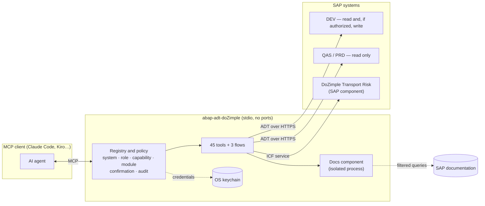

<div align="center">

# abap-adt-doZimple

**English** · [Español](README.es.md)

[](../../actions/workflows/ci.yml) [](https://www.bestpractices.dev/projects/14759)    

**AI that works on your SAP system with the rules of a senior consultant.**

An [MCP](https://modelcontextprotocol.io) server by **[DoZimple](https://dozimple.cl)** that gives AI agents —
Claude Code, Kiro or any MCP client — secure, verifiable access to SAP ABAP systems: review code and transport
requests, run ATC and ABAP Unit, diagnose incidents, query the official documentation and, where authorized, save
changes in the right transport after a human confirms them.

**45 tools · 9 functional groups · 3 guided flows · ECC 6.0 (NW 7.50) and S/4HANA**

[Features](#features-by-group) · [Full tool reference](docs/TOOLS.md) ·
[Security](SECURITY.md) · [Threat model](docs/THREAT_MODEL.md) · [DoZimple Transport Risk](#dozimple-transport-risk) · [Credits](#credits) · [Contact](https://dozimple.cl)

</div>

---

## What you can ask

> “What does transport DEVK900123 really change, and which objects usually travel with it but are missing?”
>
> “Run ATC on ZDEMO_REPORT, explain the P1 findings with their SAP note and propose the fix SAP offers.”
>
> “Can I use `COND` on this 7.50 system? If not, rewrite the method with compatible syntax and validate it against SAP.”
>
> “Last night's billing job failed: dumps, job log and application log, and tell me the probable cause.”
>
> “Is this release of four transports ready for production? Explain it in business terms for the PMO.”

The agent picks the tools, chains them and answers with evidence. Every answer states which system it comes from,
and **a failure is never presented as an empty result or as success**.

## Why it is different

| | Usual approach | **abap-adt-doZimple** |
|---|---|---|
| Systems | One per instance, no roles | Every system in the landscape, with a policy per role: DEV / QAS / PRD |
| Writes | Saves wherever SAP decides, or cannot write at all | Development only, explicit transport, preview and human confirmation; stops on another transport's CTS lock |
| Verification | abaplint or nothing | SAP's real syntax check, also on code not saved yet |
| Parameters | A misspelled parameter is silently ignored and the call runs anyway | **Unknown parameters are rejected with the list of accepted ones**: a misspelled `transprot` never runs without the transport you meant |
| Results on failure | Empty lists or misleading “OK” | Typed error saying what could not be checked and why |
| Releases | Hard-coded endpoints | Capabilities read from each system's ADT discovery |
| IDE | Often requires the IDE open | Standalone server, no IDE |
| Third parties | Dependencies mixed with credentials | Components isolated in their own process and filtered |
| Data | Whatever the SAP user can read goes to the model | Security and HR tables blocked (also through views and CDS); personal data masked on production-data systems |

## Overview

<!-- groups:start -->
| Group | What for | Tools |
|---|---|---|
| [Code review and transports](#g-revision) | Know what a transport really changes and what it may break, before releasing it. | 5 |
| [Quality, ATC and remediation](#g-calidad) | Find, understand and fix findings with SAP's real syntax check and quick fixes. | 5 |
| [Repository exploration](#g-exploracion) | Read and understand any ABAP object and its relations, on ECC and S/4HANA. | 9 |
| [Data queries](#g-datos) | Query tables with ABAP SQL, read-only, with sensitive and personal data protected. | 2 |
| [Incident diagnosis](#g-diagnostico) | One conversation for what used to take ST22, SM37, SLG1 and /IWFND/ERROR_LOG. | 4 |
| [SAP documentation](#g-documentacion) | Answer from official documentation and check which syntax exists in each release. | 7 |
| [Controlled writes](#g-escritura) | Save changes only in development, in the right transport, previewed and confirmed by a human. | 5 |
| [DoZimple Transport Risk](#g-transport-risk) | Decide whether a whole release can go to QA or production, with the why in business terms. | 7 |
| [Operations and growth](#g-operacion) | See what works on each system and decide the next tool with data. | 4 |
<!-- groups:end -->

## Architecture



## Features by group

Summary per group; each tool's details — parameters, types, defaults, requirements and credits — are in the
**[full reference](docs/TOOLS.md)** (in Spanish).

<!-- tools:start -->
<a id="g-revision"></a>
### Code review and transports

*Know what a transport really changes and what it may break, before releasing it.*

| Tool | What it does | Access |
|---|---|---|
| [`transport_diff`](docs/TOOLS.md#revision) | **What a transport changed (code diff).** Code review of a transport: for each source object (programs, includes, classes, interfaces, function modules, CDS) compares the version recorded with that transport against the previous one and shows a unified diff. | read |
| [`transport_contents`](docs/TOOLS.md#revision) | **Transport contents.** Header, tasks (owner and status) and objects of a transport request, read from E070/E07T/E071. | read |
| [`co_change`](docs/TOOLS.md#revision) | **What usually travels with this object?** Looks at the transports that touched an object and counts which other objects travelled with it, most frequent first. | read |
| [`inactive_objects`](docs/TOOLS.md#revision) | **Inactive objects.** Objects saved but not activated by the connection user, with their transport. | read |
| [`edit_preflight`](docs/TOOLS.md#revision) | **Before editing: which transport will it land in?** Tells, BEFORE changing an object, which transport the change will end up in and why: CTS lock by another transport, local object ($TMP), repair (different original system), or free with your open transports. | read |

<a id="g-calidad"></a>
### Quality, ATC and remediation

*Find, understand and fix findings with SAP's real syntax check and quick fixes.*

| Tool | What it does | Access |
|---|---|---|
| [`run_atc`](docs/TOOLS.md#calidad) | **Run ATC.** Runs the ABAP Test Cockpit on an object or a transport and lists numbered findings (priority, line, check, message) with SAP's P1/P2/P3 totals. | read |
| [`atc_quickfix`](docs/TOOLS.md#calidad) | **SAP-proposed fixes.** The fixes SAP offers (the same as Ctrl+1 in Eclipse) for an ATC finding or a line: create text symbol, extract constant, etc. | read |
| [`api_release_state`](docs/TOOLS.md#calidad) | **Is this API released? What is its successor?** Release state of an SAP object (class, function module/BAPI, table, CDS…) by contract C0–C4 and its released successor, read from the system itself. | read |
| [`syntax_check`](docs/TOOLS.md#calidad) | **SAP syntax check.** SAP's real syntax check (not abaplint), also on code not saved yet. | read |
| [`run_unit_tests`](docs/TOOLS.md#calidad) | **Run ABAP Unit.** Runs the ABAP Unit tests of a class or program (harmless and short only) and returns the result per method, with each failure in detail. | executes (DEV) |

<a id="g-exploracion"></a>
### Repository exploration

*Read and understand any ABAP object and its relations, on ECC and S/4HANA.*

| Tool | What it does | Access |
|---|---|---|
| [`search_objects`](docs/TOOLS.md#exploracion) | **Search ABAP objects.** Searches repository objects by name (supports * wildcards). | read |
| [`get_source`](docs/TOOLS.md#exploracion) | **Read ABAP source.** Reads the source of any object: program, include, class (and its includes), interface, function module (without knowing its group), CDS, table/structure, etc. | read |
| [`where_used`](docs/TOOLS.md#exploracion) | **Where used.** Where-used list of an object: who references it, with package and owner. | read |
| [`object_versions`](docs/TOOLS.md#exploracion) | **Object versions.** Version history of an object (date, author, transport). | read |
| [`package_contents`](docs/TOOLS.md#exploracion) | **Package contents.** Objects of a development package grouped by type, with subpackages (TADIR/TDEVC, any release). | read |
| [`ddic_type_info`](docs/TOOLS.md#exploracion) | **Data element, domain or table type.** Definition of a DDIC type: data element (domain, type, length, texts), domain (type, length, fixed values, value table) or table type (line type, key). | read |
| [`transaction_info`](docs/TOOLS.md#exploracion) | **What a transaction runs.** Program, screen and parameters of a transaction (TSTC/TSTCP), with its text. | read |
| [`function_modules`](docs/TOOLS.md#exploracion) | **Function modules of a group.** Lists the function modules of a function group with their text and whether they are RFC or update modules; given a module, finds its group and siblings. Works with /XXX/ namespaces. | read |
| [`text_elements`](docs/TOOLS.md#exploracion) | **Text symbols and selection texts.** Reads the text symbols (TEXT-001…), selection texts or headings of a program, class or function group. | read |

<a id="g-datos"></a>
### Data queries

*Query tables with ABAP SQL, read-only, with sensitive and personal data protected.*

| Tool | What it does | Access |
|---|---|---|
| [`sql_query`](docs/TOOLS.md#datos) | **ABAP SQL query.** Runs an ABAP SQL SELECT (WHERE, JOIN, ORDER BY, subqueries) through ADT data preview, with personal columns masked and row caps on production-data systems. | read |
| [`table_contents`](docs/TOOLS.md#datos) | **Table contents.** Rows of a table, view or CDS, with optional columns and filter. | read |

<a id="g-diagnostico"></a>
### Incident diagnosis

*One conversation for what used to take ST22, SM37, SLG1 and /IWFND/ERROR_LOG.*

| Tool | What it does | Access |
|---|---|---|
| [`dumps`](docs/TOOLS.md#diagnostico) | **Dumps (ST22).** Lists runtime dumps: date, error, program, user and short text. | read |
| [`jobs`](docs/TOOLS.md#diagnostico) | **Background jobs (SM37).** Background jobs by name (supports *), user, status and date, with their steps (program and variant). | read |
| [`application_log`](docs/TOOLS.md#diagnostico) | **Application log (SLG1) headers.** Application log headers (BALHDR) by object/subobject, external number, user and date, with error and warning counts. | read |
| [`gateway_errors`](docs/TOOLS.md#diagnostico) | **SAP Gateway errors (/IWFND/ERROR_LOG).** Lists SAP Gateway (OData) errors: service, error, user, date. | read |

<a id="g-documentacion"></a>
### SAP documentation

*Answer from official documentation and check which syntax exists in each release.*

| Tool | What it does | Access |
|---|---|---|
| [`abap_feature_matrix`](docs/TOOLS.md#documentacion) | **Since which release does this syntax exist?** Availability of each ABAP language feature per release (7.40 … 7.58, 2025). | local |
| [`docs_search`](docs/TOOLS.md#documentacion) | **Search ABAP documentation.** Searches the official ABAP keyword documentation (standard and cloud), Clean ABAP, the DSAG guide, ABAP cheat sheets and RAP samples, locally. | local |
| [`docs_fetch`](docs/TOOLS.md#documentacion) | **Read a documentation page.** Returns the full content of a document by the id docs_search gives. | local |
| [`clean_core_objects`](docs/TOOLS.md#documentacion) | **Released objects catalog (Clean Core).** Searches SAP's public catalog (abap-atc-cr-cv-s4hc, local) for released/deprecated objects by name or topic, with Clean Core level (A released … D all) and successors. | local |
| [`clean_core_object`](docs/TOOLS.md#documentacion) | **Clean Core state of an SAP object.** Release state, Clean Core level and successor of an SAP object according to the public catalog (local). | local |
| [`abap_lint`](docs/TOOLS.md#documentacion) | **abaplint on a snippet.** Runs abaplint locally (code never leaves the machine) on an ABAP snippet or source. | local |
| [`docs_community_search`](docs/TOOLS.md#documentacion) | **Search SAP Community.** Searches SAP Community (blogs and questions) by error message, class or concept. | local |

<a id="g-escritura"></a>
### Controlled writes

*Save changes only in development, in the right transport, previewed and confirmed by a human.*

| Tool | What it does | Access |
|---|---|---|
| [`write_source`](docs/TOOLS.md#escritura) | **Save source to SAP.** Replaces the FULL source of an existing object (or class include) in the given transport, after a preview with syntax check and diff and a human confirmation. | writes (authorized DEV) |
| [`revert_source`](docs/TOOLS.md#escritura) | **Revert to an earlier version.** Writes back an earlier version of an object (the last active one, the one before it, or a numbered one from object_versions) through the same preview, fingerprint, lock and transport as write_source; never reverts on its own. | writes (authorized DEV) |
| [`activate`](docs/TOOLS.md#escritura) | **Activate object.** Activates an object and returns SAP's messages as they are (errors with line, warnings, objects left inactive). | writes (authorized DEV) |
| [`write_text_elements`](docs/TOOLS.md#escritura) | **Create or change text symbols.** Adds or changes text symbols (or selection texts) of a program/class/group, merging with the existing ones: nothing not mentioned is deleted. | writes (authorized DEV) |
| [`create_transport`](docs/TOOLS.md#escritura) | **Create transport request.** Creates a workbench request for an object's package BEFORE the first edit, so the change lands in the ticket's transport and not in a reused task. | writes (authorized DEV) |

<a id="g-transport-risk"></a>
### DoZimple Transport Risk

*Decide whether a whole release can go to QA or production, with the why in business terms.*

| Tool | What it does | Access |
|---|---|---|
| [`analyze_transport_risk`](docs/TOOLS.md#transport-risk) | **Transport risk.** Tells whether a transport (or a release of several, comma-separated) is safe to move to QA or production: unreleased tasks, import status, dependencies that don't travel, positional access, CTS locks, import queue. | read |
| [`import_health`](docs/TOOLS.md#transport-risk) | **Import health.** Health of the imports into a target (QA or production): answers “how are the releases to production going?”. | read |
| [`failure_ranking`](docs/TOOLS.md#transport-risk) | **Objects that fail most on import.** Ranking of objects by import failure history in a target. | read |
| [`change_audit`](docs/TOOLS.md#transport-risk) | **Change audit evidence.** Evidence for a change management audit on a target: what went in, with which ticket, initiative and origin. | read |
| [`object_transport_history`](docs/TOOLS.md#transport-risk) | **Transport history of an object.** Which transports touched an object, when, and which already reached the target. | read |
| [`remote_source`](docs/TOOLS.md#transport-risk) | **Source on the target.** The source of an object AS IT IS in QA or production, read through TMS (like “Retrieve remote versions”). | read |
| [`transport_source_check`](docs/TOOLS.md#transport-risk) | **Transport code against the target.** Compares the code of a transport's objects with the target: objects missing there (R3.4) and version drift — signatures, fields or parameters that differ and don't travel in the transport (R3.5). | read |

<a id="g-operacion"></a>
### Operations and growth

*See what works on each system and decide the next tool with data.*

| Tool | What it does | Access |
|---|---|---|
| [`sap_systems`](docs/TOOLS.md#operacion) | **SAP systems and available tools.** Lists the configured systems (role, writes, data class, modules) and, optionally, checks connectivity and which tools work on each. | local |
| [`report_gap`](docs/TOOLS.md#operacion) | **Record a missing tool.** Records a need no tool covers (e.g. something you had to do manually in a transaction), to decide what to build next. | local |
| [`close_gap`](docs/TOOLS.md#operacion) | **Close a recorded gap.** Marks a gap recorded with report_gap as resolved, with a note (a tool now covers it, or the note turned out to be wrong); nothing is deleted. | local |
| [`usage_stats`](docs/TOOLS.md#operacion) | **Tool usage and gaps.** Summary of the local log: calls per tool, failure rate and type, systems, and the gaps recorded with report_gap. | local |

<!-- tools:end -->

## Guided flows

<!-- prompts:start -->
They show up as commands in the MCP client (in Claude Code: `/mcp__abap-adt-doZimple__<name>`) and chain the tools
with the working rules of a senior consultant.

| Flow | What it does | Chain |
|---|---|---|
| `revisar_pase` — Review a transport before release | Full review of a transport: code, missing companions, locks and, with the risk module, its analysis. | transport_contents → transport_diff → inactive_objects → co_change + edit_preflight → analyze_transport_risk (if module) → three-layer report: business, consultant, Basis |
| `remediar_atc` — Remediate ATC findings of an object | ATC → documentation and SAP note → released successor → fix → syntax → save in the transport. | edit_preflight → run_atc (BEFORE) → explain + api_release_state + where_used/object_versions → CHANGE/INVESTIGATE/KEEP classification → atc_quickfix → syntax_check → write_source in the transport (with human OK) → run_atc (AFTER) and P1 reduction |
| `diagnosticar_ticket` — Diagnose an incident | Dumps, jobs, application log and Gateway errors around an incident. | dumps → jobs → application_log → gateway_errors → transaction_info / get_source / object_versions / transport_contents → probable cause with evidence and what could not be checked |
<!-- prompts:end -->

## DoZimple Transport Risk

The most valuable module for operations: **before releasing, it tells whether a transport or a whole release can go
to QA or production, and why not**, in three layers — a business verdict for the PMO, what to review for the
consultant, and release actions for Basis.

- **Whole releases, not single transports:** what travels in one transport covers the others; it computes the import
  sequence and detects mutual dependencies and collisions between transports.
- **What breaks silently:** positional access to structures that change, code and dictionary dependencies that don't
  travel and don't exist on the target, version drift.
- **The real state of the landscape:** target import queue, CTS locks, transports of copies that drag other people's
  changes, import health and the objects that fail most.
- **Evidence for change management audits.**

It works on any ABAP stack with CTS (ECC and S/4HANA) and is read-only on every system. It requires a **proprietary
DoZimple SAP component** (ICF service in development and read-only RFCs on the targets), which is not distributed in
this repository.

**Want it in your landscape? → [dozimple.cl](https://dozimple.cl)**

## Security

Designed to pass a Security and Basis review without exceptions. Details: **[SECURITY.md](SECURITY.md)** and the
**[threat model](docs/THREAT_MODEL.md)** (STRIDE and OWASP Top 10 for LLM applications).

- **No network surface:** stdio only; no ports are opened.
- **Credentials in the OS keychain** (macOS Keychain or Linux Secret Service), never in files, logs or responses.
- **Policy per role:** QA and production are never written; development only with explicit authorization.
- **Strict parameters:** an unknown or misspelled parameter is an error listing the accepted ones, never silently ignored.
- **No write without human confirmation:** a preview with SAP's syntax check and the real diff, confirmed through MCP
  elicitation or a single-use token bound to those exact arguments.
- **Hash-chained audit log** of every write and execution, fail-closed (no log, no write), verifiable with
  `npm run audit:verify`.
- **SAP credential material and HR data blocked** in SQL queries, also through views and CDS, even if the SAP user is
  authorized. Validated against a real S/4HANA 2023 system, where standard views and CDS read USR02 without naming it.
- **Personal data masked and row caps** on systems with production data.
- **No customer data to the internet:** online documentation search is off by default and, when enabled, every query
  with objects, transports, systems, users or customer names is blocked.
- **Third parties isolated** in their own process with a minimal environment.
- **Controlled supply chain:** 4 production dependencies pinned to exact versions, no install scripts, verified
  registry signatures, CycloneDX SBOM, audit and secret scanning on every commit and in CI.

## Compatibility

| | |
|---|---|
| SAP | ECC 6.0 / NetWeaver 7.50 and later, and S/4HANA on-premise or private cloud, through ADT (`/sap/bc/adt`). Tested live on S/4HANA 2023 (SAP_BASIS 7.58) and ECC 6.0 EHP8 (SAP_BASIS 7.50). Release-dependent features (e.g. API release state) are detected per system |
| MCP clients | Claude Code, Kiro and any MCP client over stdio |
| Platform | Node.js 22+. Credentials in the macOS Keychain, the Linux Secret Service or environment variables |

## Installation

### From npm (recommended)

Pinned to an exact version, without install scripts, like the project's own dependencies:

```sh
npm install -g --ignore-scripts @dozimple/abap-adt@1.1.0
PKG="$(npm root -g)/@dozimple/abap-adt"
mkdir -p ~/.config/abap-adt-dozimple && chmod 700 ~/.config/abap-adt-dozimple
cp "$PKG/config/systems.example.json" ~/.config/abap-adt-dozimple/systems.json   # systems, roles and permissions
chmod 600 ~/.config/abap-adt-dozimple/systems.json
sh "$PKG/scripts/set-password.sh" MY_DEV                                        # prompts; stored in the keychain
node "$PKG/dist/scripts/smoke.js" MY_DEV                                        # read-only validation
```

MCP client registration:

```json
{ "mcpServers": { "abap-adt-doZimple": { "command": "abap-adt-dozimple" } } }
```

Every release is published from CI with [npm provenance](https://docs.npmjs.com/generating-provenance-statements):
`npm view @dozimple/abap-adt@1.1.0 dist.attestations` shows the attestation, and the GitHub release carries the
tarball, its Sigstore bundle (`.sigstore.json`), the same bundle as in-toto provenance (`.intoto.jsonl`) and the
SBOM. To check it: `gh attestation verify dozimple-abap-adt-1.1.0.tgz --repo <owner>/abap-adt-dozimple`.

### From source

```sh
npm ci && npm run build
mkdir -p ~/.config/abap-adt-dozimple
cp config/systems.example.json ~/.config/abap-adt-dozimple/systems.json   # systems, roles and permissions (chmod 600)
scripts/set-password.sh MY_DEV                                           # prompts for the password; stored in the keychain
npm run smoke -- MY_DEV                                                  # read-only validation
```

MCP client registration:

```json
{ "mcpServers": { "abap-adt-doZimple": { "command": "node", "args": ["/path/to/abap-adt-doZimple/dist/index.js"] } } }
```

**SAP documentation** group (optional): install [mcp-sap-docs](https://github.com/marianfoo/mcp-sap-docs)
(Apache-2.0, `abap` variant) in a separate folder and declare how to start it in `sidecars.docs` of `systems.json`
(see `config/systems.example.json`). It runs as an isolated process; online search stays off unless `allowOnline`.

See [CONTRIBUTING.md](CONTRIBUTING.md). To contribute or extend: `git config core.hooksPath .githooks` (secret and customer-data scanner before every commit)
and the [`nueva-tool`](.claude/skills/nueva-tool/SKILL.md) guide — adding a tool means adding one file. Code comments
and tool descriptions are in Spanish; contributions in English are welcome.

## Credits

abap-adt-doZimple is built on other people's work, and says so: each tool lists its credits in the
[reference](docs/TOOLS.md). **Dependency**: its code is used. **Data**: third-party content that is queried.
**Idea**: a design studied and reimplemented without copying code. **Algorithm**: a published method.

<!-- credits:start -->
| Project | Author / holder | License | Type | Used in |
|---|---|---|---|---|
| [abap-adt-api](https://github.com/marcellourbani/abap-adt-api) | Marcello Urbani | MIT | dependency | all (core), `transport_diff`, `transport_contents`, `inactive_objects`, `edit_preflight`, `run_atc` and 23 more |
| [Model Context Protocol TypeScript SDK](https://github.com/modelcontextprotocol/typescript-sdk) | Model Context Protocol | MIT | dependency | all (core) |
| [mcp-sap-docs](https://github.com/marianfoo/mcp-sap-docs) | Marian Zeis (marianfoo) | Apache-2.0 | dependency | `abap_feature_matrix`, `docs_search`, `docs_fetch`, `clean_core_objects`, `clean_core_object`, `abap_lint` and 1 more |
| [abaplint](https://github.com/abaplint/abaplint) | Lars Hvam and contributors | MIT | dependency | `abap_lint` |
| [zod](https://github.com/colinhacks/zod) | Colin McDonnell and contributors | MIT | dependency | all (core) |
| [ABAP Keyword Documentation](https://help.sap.com/doc/abapdocu_latest_index_htm/latest/en-US/index.htm) | SAP SE | © SAP SE | data | `docs_search`, `docs_fetch` |
| [ABAP Cheat Sheets](https://github.com/SAP-samples/abap-cheat-sheets) | SAP (SAP-samples) | Apache-2.0 | data | `docs_search` |
| [Clean ABAP (SAP Style Guides)](https://github.com/SAP/styleguides) | SAP | per repository | data | `docs_search` |
| [DSAG ABAP-Leitfaden](https://github.com/marianfoo/DSAG-ABAP-Guide) | DSAG e.V. | per repository | data | `docs_search` |
| [ABAP Feature Matrix](https://software-heroes.com/en/abap-feature-matrix) | Software-Heroes | © Software-Heroes | data | `abap_feature_matrix` |
| [Released objects / Cloudification Repository (abap-atc-cr-cv-s4hc)](https://github.com/SAP/abap-atc-cr-cv-s4hc) | SAP | Apache-2.0 | data | `clean_core_objects`, `clean_core_object` |
| [SAP Community / SAP Help Portal](https://community.sap.com) | SAP SE and community authors | SAP terms | data | `docs_community_search` |
| [ABAP Remote FS (vscode_abap_remote_fs)](https://github.com/marcellourbani/vscode_abap_remote_fs) | Marcello Urbani | MIT | idea | `syntax_check` |
| [mcp-abap-adt](https://github.com/mario-andreschak/mcp-abap-adt) | mario-andreschak | MIT | idea | `search_objects`, `get_source`, `package_contents`, `ddic_type_info`, `transaction_info`, `table_contents` |
| [ARC-1](https://github.com/arc-mcp/arc-1) | arc-mcp (Marian Zeis and contributors) | MIT | idea | `transport_diff`, `atc_quickfix`, `gateway_errors` |
| [vibing-steampunk](https://github.com/oisee/vibing-steampunk) | oisee and contributors | MIT | idea | `co_change`, `api_release_state`, `jobs`, `application_log` |
| [ABAP Accelerator for Amazon Q Developer](https://github.com/aws-solutions-library-samples/guidance-for-deploying-sap-abap-accelerator-for-amazon-q-developer) | AWS Solutions Library Samples | MIT-0 | idea | all (core), `usage_stats` |
| [An O(ND) Difference Algorithm and Its Variations (1986)](https://doi.org/10.1007/BF01840446) | Eugene W. Myers | published algorithm | algorithm | `transport_diff`, `atc_quickfix` |
<!-- credits:end -->

Full dependency licenses: [THIRD_PARTY_NOTICES.md](THIRD_PARTY_NOTICES.md). If you are the author of one of these
projects and want to adjust how you are credited, reach us at [dozimple.cl](https://dozimple.cl).

## About DoZimple

**[DoZimple](https://dozimple.cl)** — technology that connects operations, data and innovation. SAP consulting and
development (ABAP, CDS, OData, RAP, Fiori), integration and SAP BTP, software and portals connected to the ERP, and
applied artificial intelligence over controlled sources, with reproducible answers and human review.

This MCP server is an example of how we work: useful AI, with control, traceability and security by design.
**Let's talk → [dozimple.cl](https://dozimple.cl)**

## License

[Apache-2.0](LICENSE) — © 2026 [DoZimple](https://dozimple.cl). See also [NOTICE](NOTICE). The DoZimple Transport Risk
SAP component is proprietary and not part of this repository. SAP, ABAP and S/4HANA are trademarks of SAP SE; this
project is not affiliated with SAP SE.
