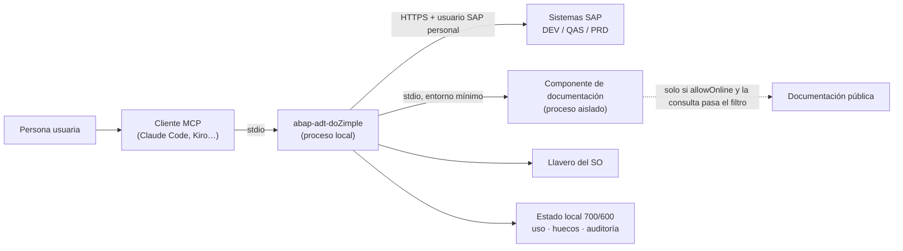

# Modelo de amenazas — abap-adt-doZimple

Resumen de controles: [SECURITY.md](../SECURITY.md). Este documento explica **contra qué** se diseñaron y **qué
queda fuera**.

## Alcance y fronteras de confianza

| Frontera | Qué la cruza | Supuesto |
|---|---|---|
| Cliente ↔ servidor | Llamadas a tools y sus respuestas | El modelo **no es de confianza**: puede equivocarse o haber sido manipulado por contenido que leyó |
| Servidor ↔ SAP | Lecturas y, en DEV habilitado, escrituras | Las autorizaciones SAP del usuario son el límite superior; el servidor solo resta |
| Servidor ↔ componente de documentación | Consultas conceptuales | El componente es código de terceros: sin credenciales, sin entorno, filtrado |
| Servidor ↔ internet | Solo consultas de documentación filtradas | Nada del cliente sale; el contenido que entra es no confiable |
| Equipo local | Configuración, llavero, registros | El equipo y la cuenta del usuario están bajo control del usuario |

## STRIDE

| Amenaza | Escenario | Control | Residual |
|---|---|---|---|
| **S**uplantación | Otro proceso lee la contraseña del llavero | Llavero del SO; `--strict` (opt-in) exige confirmación en cada lectura | Sin `--strict`, un proceso del mismo usuario que invoque `security` puede leerla. Solución de raíz prevista: certificado de cliente / SSO (roadmap) |
| **S**uplantación | TLS interceptado | Verificación TLS; `caFile` | `allowSelfSigned` sigue existiendo como último recurso, marcado |
| **T**ampering | Cambiar `systems.json` para habilitar escritura o redirigir a otro host | Rechazo si es modificable por otros o de otro usuario | Un proceso del propio usuario puede modificarlo |
| **T**ampering | Retocar el registro de auditoría | Cadena de hash verificable | Un atacante con la cuenta del usuario puede reescribir la cadena entera; para evidencia fuerte, enviar el registro a un almacén externo (ver roadmap) |
| **R**epudio | «La IA lo cambió sola» o «no hay constancia de ese cambio» | Confirmación humana con vista previa + auditoría con forma de confirmación y huella del contenido. **Fail-closed**: la intención se registra antes de tocar SAP, y si no se puede registrar (disco lleno, permiso denegado, ruta inválida) la escritura no se ejecuta. Si lo que falla es solo el registro del resultado, la respuesta lo avisa explícitamente. Cubierto por tests que simulan ENOSPC y EACCES | El registro es local; un corte de energía entre intención y resultado deja una intención sin resultado, que se interpreta como «estado desconocido, verificar en SAP» |
| **I**nformation disclosure | Leer hashes, almacén seguro, PSE, OAuth, dumps | Veto directo y a través de vistas y CDS | Tablas Z que copien esos datos no se detectan por nombre |
| **I**nformation disclosure | Volcar datos personales al proveedor LLM | Clase de datos, enmascarado, tope de filas | Columnas personales con nombres no estándar (Z) no se enmascaran; el tope limita el volumen |
| **I**nformation disclosure | Nombres de cliente u objetos Z hacia internet | Online apagado; filtro de consultas e ids | Un concepto puede describir un proceso de negocio sin nombrarlo |
| **D**enegación de servicio | Consultas enormes o bucles del agente contra SAP | Topes de filas, de salida (80k) y de objetos; timeouts | Un where-used masivo sigue costando ~1 min al servidor SAP |
| **E**levación de privilegios | Escribir en QAS/PRD o ejecutar código fuera de DEV | Política por rol independiente de la configuración de escritura | — |
| **E**levación de privilegios | Test ABAP Unit peligroso | Solo HARMLESS / SHORT | Un test mal clasificado por su autor como HARMLESS |

## OWASP Top 10 para aplicaciones LLM (2025)

| Riesgo | Cómo aplica a un MCP de SAP | Control |
|---|---|---|
| LLM01 Prompt injection | Comentarios en fuente ABAP, textos, datos de tablas, documentación o posts de comunidad con instrucciones | Marca de «dato, nunca instrucciones» en toda respuesta; ninguna escritura sin confirmación humana; tools de escritura destructivas para el cliente |
| LLM02 Divulgación de información sensible | Datos personales y material de seguridad en respuestas que llegan al proveedor | Vetos, enmascarado, tope de filas, filtro de salida a internet |
| LLM03 Cadena de suministro | Dependencias npm, MCP de terceros | Versiones exactas, firmas, SBOM, `ignore-scripts`, terceros aislados tras revisión |
| LLM05 Manejo inadecuado de la salida | El agente usa una respuesta como si fuera verdad | Errores tipados que nunca parecen vacíos; «tope alcanzado» explícito; calidad de la evidencia en diffs |
| LLM06 Agencia excesiva | El agente escribe, activa o crea órdenes por su cuenta | Mínimo privilegio por tool y rol; escritura desactivada por defecto; confirmación con vista previa; sin liberar, importar ni borrar |
| LLM07 Filtrado del prompt de sistema | — | El servidor no tiene prompts secretos; las recetas guiadas son públicas |
| LLM08 Debilidades de vectores y embeddings | Índice local de documentación | Solo documentación pública; ningún dato del cliente se indexa |
| LLM09 Desinformación | Afirmar que algo está en productivo sin comprobarlo | Honestidad de errores; comprobación real contra SAP (sintaxis, versiones, cola de importación) |
| LLM10 Consumo sin límites | Respuestas enormes, bucles | Topes de salida, filas y objetos |

## Fuera de alcance

- Compromiso de la cuenta del usuario o del equipo.
- Autorizaciones SAP mal diseñadas: el servidor no las sustituye.
- Lo que el proveedor del modelo haga con las respuestas: se reduce lo que se le envía, no se controla su lado.
- Transportes y cambios hechos fuera de este servidor (SE80, Eclipse, abap-fs).

## Roadmap de seguridad

- **Autenticación sin contraseña reutilizable** (Sprint 2): certificado de cliente X.509 y SSO (SAML / principal
  propagation) hacia ADT, para que no exista un secreto que leer del llavero.
- Envío opcional del registro de auditoría a un almacén externo o SIEM (append-only fuera del equipo).
- Diccionario de columnas personales ampliable por configuración (campos Z).
- Firma de las versiones publicadas (procedencia npm / Sigstore) si se distribuye como paquete.
